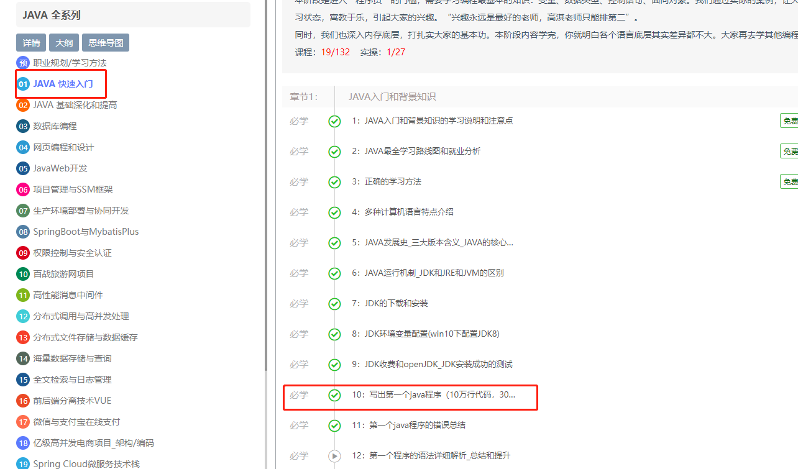
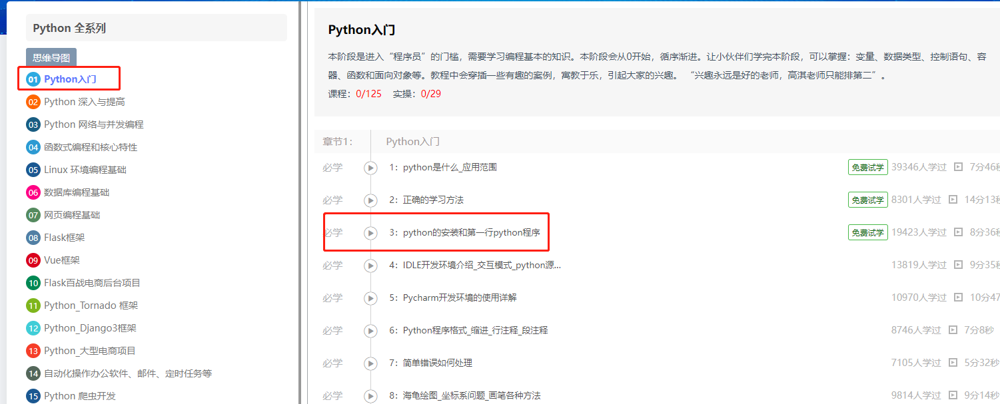
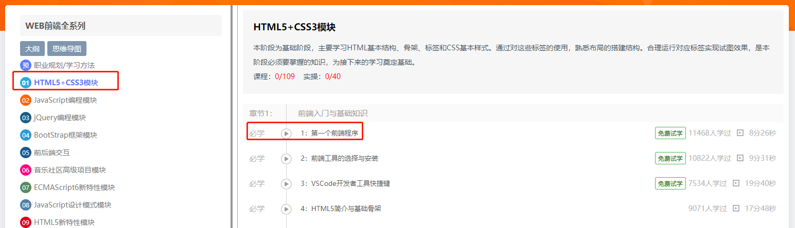
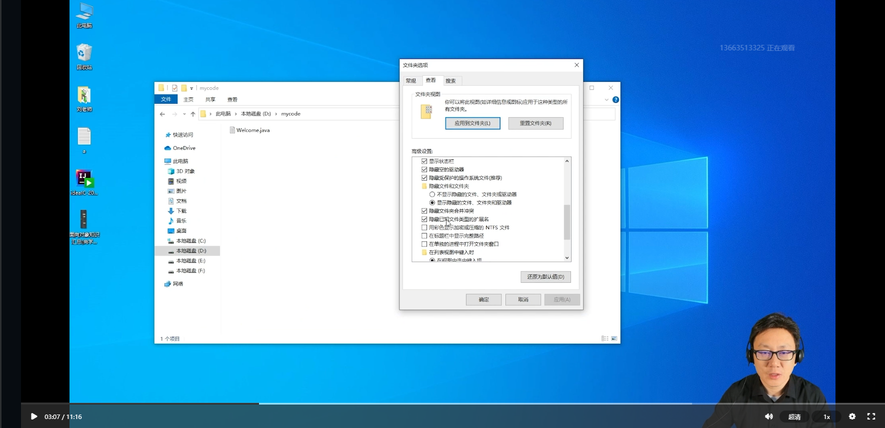
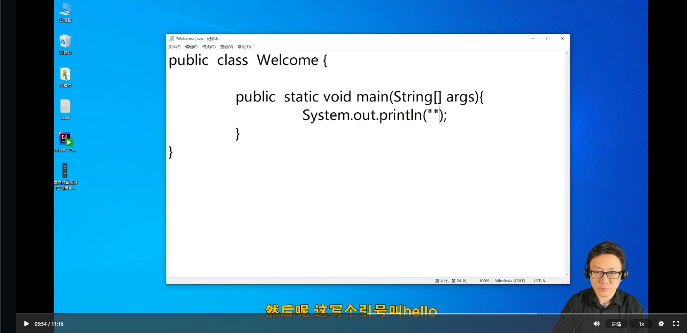

1. 通过向日葵软件连接学生计算机

2. 简单寒暄。了解学生信息，如大学/专业、工作状态（不用问名字 ）

3. 再次强调**一个确保**

4. 强调学习方法（跟着老师课堂上的代码去敲，不用创新，就能找到很好的工作），增强学习信心

5. 给学员配置好开发环境与相关软件，并叮嘱**不需要**自己**重新配置**，可以看看相关课程

   - Java软件：JDK安装与环境配置，IDEA安装与破解
   - Python软件：Python安装，Pycharm安装
   - 前端软件:vscode安装
   - 通用软件：向日葵完整版，EV录屏，谷歌浏览器

6. 陪同学生远程观看部分课程，共同学习，学员有任何疑问第一时间解决

   - Java需要共同学习的课程

     第一阶段     章节1     10.写出第一个java程序

     

   - Python需要共同学习的课程

     第一阶段     章节1      3.python的安装和第一行python程序

     

   - 前端需要共同学习的课程

     第一阶段     章节1      1.第一个前端程序

     

7. 讲解过程中，在重难点或者需要学生操作的地方暂停，给学生重点讲解，同时督促学生进行实操，最终保证学员顺利执行Hello World

   **如**：

   - 讲解到显示扩展名，可以暂停，帮助学生配置windows，打开扩展名之后，继续播放

     

   - 该写代码时，可以适当暂停，等待学生完成之后，继续学习

     

8. 同时，模拟程序报错，带领学员通过问答模块提问，或者通过EV录屏进行问题录制

9. 结束课程，鼓励性话

**注：**

- 第6步骤，以学生实操为主导

- 所有安装路径，**不允许出现中文**

- 不要直接添加学生联系方式

- 修改windows用户名为英文

- 总时间控制在30-50分钟内

- 提前5-10分钟给咨询老师发腾讯会议链接

  